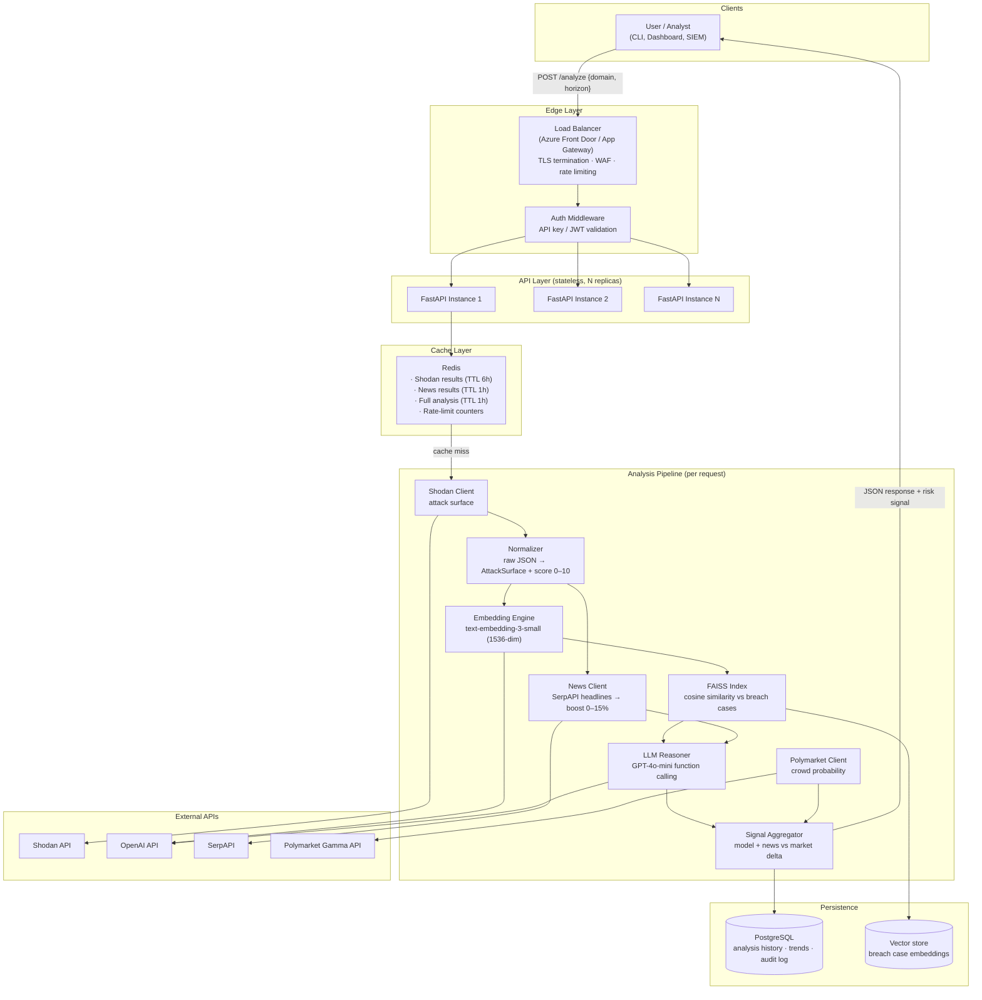

# ThreatSignal AI — System Design Document

> Presenting ThreatSignal AI as a production cloud service: architecture, design patterns, request flow, trade-offs, bottlenecks, scaling strategy, and engineering methodology.

---

## 1. Architecture Chart

---

## 2. Reading the Chart — the User's Journey

A single request travels through the system like this:

1. **User → Load Balancer.** An analyst (or an automated SIEM integration) sends `POST /analyze {"domain": "okta.com", "time_horizon_days": 30}`. The load balancer terminates TLS, applies WAF rules, and enforces per-client rate limits *before* any compute is spent — the request is cheap to reject at the edge, expensive to reject deep in the pipeline.
2. **Authentication.** The auth middleware validates the API key / JWT and resolves the client's quota tier. Unauthenticated traffic never reaches the API layer — this matters because every analysis fans out to four paid external APIs; an open endpoint is a paid-API amplifier.
3. **API instance (stateless).** The balancer routes to any healthy FastAPI replica. Instances hold no session state — the FAISS index is read-only and loaded at startup via the lifespan hook, everything else lives in Redis/Postgres — so replicas are interchangeable and horizontally scalable.
4. **Cache check.** Redis is consulted first: a full analysis for the same domain within the TTL returns in ~5ms with zero external cost. Attack surfaces don't change hourly; recomputing them per request is pure waste.
5. **The pipeline (cache miss).** Independent stages run **concurrently** where the data flow allows: Shodan, News, and Polymarket have no dependency on each other and fan out in parallel. The dependent chain is Shodan → Normalizer → Embedding → FAISS → LLM.
6. **Aggregation.** The `SignalAggregator` combines the LLM probability, the deterministic news boost, and the Polymarket delta into one typed `FinalSignal` with a human-readable interpretation.
7. **Persistence + response.** The full result is written to PostgreSQL (feeding trend analysis and audit history), cached in Redis, and returned as validated JSON.

The design principle across the whole flow: **fail cheap and early at the edge; degrade gracefully in the middle; never lose a result at the end.**

---

## 3. Design Patterns Used

| Pattern | Where | Why |
|---|---|---|
| **Pipeline (Pipes & Filters)** | The core `_run_analysis` flow | Each stage consumes and produces a typed object; stages are replaceable and independently testable |
| **Adapter** | `ShodanClient`, `NewsClient`, `PolymarketClient`, `EmbeddingEngine` | Each external API's messy raw shape is adapted into a clean internal Pydantic model; the pipeline never sees vendor JSON |
| **Facade** | `BreachIndex` over FAISS | The pipeline calls `search(vector, top_k)`; the FAISS index type (Flat/IVF/HNSW) can change with zero caller impact |
| **Strategy** | `LLMReasoner`: function-calling vs JSON-mode; OpenAI vs Azure OpenAI | The reasoning "how" is swappable behind one `assess()` interface — provider migration is a config change |
| **Retry with Exponential Backoff** | LLM calls (3 attempts, 1s/2s/4s) | Rate limits and transient failures are expected, not exceptional |
| **Fallback / Graceful Degradation** | Every external dependency | No news key → skip layer; no market → `MARKET_NOT_AVAILABLE`; LLM dead → conservative fallback assessment flagged for manual review |
| **Circuit Breaker** (production) | Around each external API client | After N consecutive failures, stop calling a dead dependency and serve degraded results instead of stacking timeouts |
| **Repository** | Report/trend persistence | Storage backend (JSON files → PostgreSQL) swaps without touching business logic |
| **Singleton (config)** | `pydantic-settings` `Settings` object | One validated, typed source of truth for all env configuration |
| **Schema-first contracts** | Pydantic models at every boundary | Data is validated where it enters, not where it crashes |

---

## 4. Pros and Cons of This Design

### Pros
- **Stateless API layer** — trivially horizontally scalable; any replica can serve any request; rolling deploys with zero drama.
- **Typed boundaries everywhere** — a malformed external response fails loudly at the adapter, with a clear error, instead of corrupting downstream logic.
- **Every dependency is optional at runtime** — the system's answer degrades in *quality*, never in *availability*. A risk tool that crashes on partial data is useless to an analyst.
- **Cache-first economics** — the marginal cost of a repeated query drops from ~$0.01 + 10–30s to ~free + 5ms.
- **Independent testability** — each stage is unit-tested with mocks; the pipeline is E2E-tested with fakes; real-API contract tests run separately.

### Cons
- **Latency is dominated by external APIs** — the LLM call alone is 1–10s; no architecture choice makes a synchronous request fast when a third party is slow.
- **Cost per request is real money** — four paid APIs per cache miss; abuse protection and quotas are load-bearing, not nice-to-have.
- **Eventual consistency of the cache** — a breach can happen *inside* the TTL window; the cache trades freshness for cost. For a risk product, TTLs must be tunable per client.
- **The breach dataset is curated, not live** — similarity retrieval is only as good as the corpus; a static corpus decays.
- **Correctness of the probability is unproven** — the pipeline is verified; the *calibration* is not (see §9).

---

## 5. What I Would Change, and Why

1. **Go fully async end-to-end.** The pipeline fans out to four I/O-bound APIs — this is the textbook case for `asyncio` + `AsyncOpenAI` + `httpx.AsyncClient`. Concurrent fan-out cuts wall-clock time from the *sum* of API latencies to the *max* of them.
2. **Queue-based processing for bulk work.** For "analyze these 500 domains", a synchronous HTTP request is the wrong shape. Accept the job, return `202 Accepted` + job ID, process via a worker queue (Azure Service Bus / Celery), deliver via webhook or polling endpoint.
3. **Replace file-based trend storage with PostgreSQL.** JSON files in `reports/` don't survive horizontal scaling (each replica sees different files) and can't answer "show me this domain's 90-day risk curve" efficiently.
4. **Separate the news signal from the LLM prompt** to eliminate double-counting: either the headlines inform the LLM *or* they drive the deterministic boost — not both feeding the same final number.
5. **Liquidity-gate the Polymarket signal.** A market with $200 of liquidity is noise, not crowd wisdom; below a threshold, treat it as `NOT_FOUND`.

---

## 6. The Bottleneck

**The LLM call is the bottleneck — by an order of magnitude.**

| Stage | Typical latency |
|---|---|
| Redis cache hit | ~5 ms |
| FAISS search | < 1 ms |
| Normalization / aggregation | < 10 ms |
| Embedding call | ~200–500 ms |
| Shodan / SerpAPI / Polymarket | ~1–5 s each (parallelizable) |
| **GPT-4o-mini reasoning call** | **~1–10 s** |

Mitigations, in order of leverage:
1. **Cache** — the only way to make it 0 ms is not to make the call.
2. **Parallelize everything that doesn't depend on it** — the LLM call sits at the end of the dependency chain; everything else should already be done when it starts.
3. **Bound it** — `max_tokens=600`, `temperature=0.2`, 30s timeout: cap both cost and tail latency.
4. **Tier it** — a cheap/fast model for LOW-risk quick triage, escalating to a stronger model only when the preliminary signal crosses a threshold. This is the same "arbitration" idea as DLP classification tiers: cheap filter first, expensive judgment only when needed.

The second bottleneck is **quota**: Shodan free tier is 1 req/s. The cache and a client-side rate limiter make this invisible to users.

---

## 7. Embeddings — What, Why, Trade-offs

**Choice: OpenAI `text-embedding-3-small` (1536 dimensions) + FAISS `IndexFlatIP` with L2-normalized vectors (= exact cosine similarity).**

**Why this model:**
- Strong semantic quality on short technical text (service banners, CVE lists, breach summaries) at ~$0.00002 per query — cost is effectively zero at this scale.
- 1536 dims is enough to separate breach *patterns* (supply chain vs ransomware vs credential theft) without paying the storage/latency tax of `3-large`'s 3072 dims.
- Same API family as the reasoning model — one SDK, one auth path, one failure mode to handle, and a native Azure OpenAI deployment path.

**Why embeddings at all (vs keyword matching):** an attack surface saying "outdated OpenSSL on a non-standard port at an identity provider" should match the Okta 2022 case even though they share almost no keywords. Semantic similarity is the point; TF-IDF wouldn't capture it.

**Trade-offs accepted:**
- **API dependency** — embedding requires a network call; a local model (`all-MiniLM-L6-v2`, 384-dim) would be free and offline, at lower quality. The clean design keeps `EmbeddingEngine` as an adapter so a local fallback is a drop-in.
- **Version pinning** — embeddings from different model versions are not comparable. The index and query **must** use the same pinned model; changing models means re-embedding the whole corpus (which is why the index is built offline by `scripts/build_index.py`).
- **Exact vs approximate search** — `IndexFlatIP` is exact and O(N); correct for a small corpus, and the `BreachIndex` facade means swapping to HNSW at 1M+ vectors touches one file.

**Preprocessing before embedding:**
- Raw Shodan JSON is **normalized** first: deduplicated IPs/ports/services, CVEs extracted, capped lists (20 services, 10 CVEs) to bound size.
- The surface is rendered into a **stable templated snapshot paragraph** — same field order every time — so identical surfaces produce identical embeddings (reproducibility), and the text stays well under token limits.
- The same template feeds the LLM prompt: one canonical representation, two consumers.

---

## 8. Authentication (Production Design)

- **Edge:** TLS everywhere; WAF at the load balancer.
- **API keys per client**, stored hashed, resolved by middleware to a client identity + quota tier. For interactive dashboard users: JWT via the identity provider (Azure AD / Entra).
- **Rate limiting keyed on client identity** in Redis (sliding window) — protects both the service and the downstream API budget.
- **Secrets handling:** all provider keys (OpenAI, Shodan, SerpAPI) live in Azure Key Vault, injected as environment variables into Container Apps at deploy time — never in the image, never in the repo (`.env` git-ignored, `.env.example` committed).
- **Least privilege:** the container runs as a non-root user; no shell-outs, no SQL string building — Pydantic-validated input only.
- **Error hygiene:** 5xx responses return an opaque error ID; details go to server-side logs only.

---

## 9. Features I Would Add Next

1. **Calibration backtesting** — the highest-value addition: historical exposure snapshots before known breach dates vs matched controls, scored with a Brier score / calibration curve. Turns "a number" into "a number you can trust."
2. **Bulk analysis + ranked triage** — accept N domains, return a prioritized risk table; this is the actual analyst workflow ("which of my 50 vendors do I look at first?").
3. **Automated corpus ingestion** — pull new breach cases from CISA KEV / threat-intel feeds, embed, and hot-add to the index; kills the static-corpus decay problem.
4. **Alerting** — webhook/Slack/email when a tracked domain's risk crosses a threshold or trend flips to INCREASING.
5. **Multi-tenant history dashboard** — per-client scan history, trend curves, exportable reports.

### How I Overcome a Feature That Doesn't Work

The system is designed so that **every feature is allowed to fail without taking the product down** — this was a first-class design goal, not an afterthought:

- **Detection**: every external call has a timeout and typed error handling; failures are logged with context, never swallowed silently.
- **Containment**: a failing layer returns an explicit degraded status (`MARKET_NOT_AVAILABLE`, empty news signal, fallback LLM assessment with `confidence=0.1`) instead of an exception propagating up. The response schema makes degradation *visible* to the consumer — the report says what's missing.
- **Recovery**: retries with backoff for transient failures; circuit breaker for persistent ones; the feature re-enables itself when the dependency recovers.
- **Honesty**: a degraded answer explicitly lowers `confidence` and flags manual review. The one unforgivable failure mode for a risk product is confidently reporting a number it didn't actually compute.

---

## 10. How I Would Scale It

**Phase 1 — vertical simplicity (current scale):** one container, cache, done. Don't build for traffic you don't have.

**Phase 2 — horizontal API (100s of req/min):**
- N stateless FastAPI replicas behind the load balancer with autoscaling on CPU/latency.
- Redis for shared cache + rate-limit state; PostgreSQL for shared persistence.
- Read-only FAISS index baked into the image — every replica has it locally, zero network hop for similarity search.

**Phase 3 — asynchronous throughput (1000s of domains/day):**
- Job queue decouples accept from process; workers scale independently of the API.
- Batch embedding calls (one OpenAI request, many inputs).
- Model tiering for the LLM stage (cheap triage → expensive judgment).
- Vector store service (pgvector / managed vector DB) once the corpus needs live updates and exceeds what a baked index handles cleanly.

**Phase 4 — multi-region:** replicate the stateless layer per region; keep Postgres primary + read replicas; cache is per-region. The pipeline's statelessness is what makes this phase boring — which is the goal.

---

## 11. Development Methodology — Stubs, Mocks, TDD

**Why this methodology for this project:** the system is 80% integration with external APIs I don't control, can't make deterministic, and pay per call. Testing against the real world is slow, flaky, and expensive — so the test strategy is built around **substituting the world**:

- **Stubs** — canned realistic fixtures (a real Shodan response for okta.com, a real Polymarket market object) drive the normalizer and parsers. Stubs answer: *"given this known input, is my logic right?"*
- **Mocks** — patched HTTP clients verify *interaction*: that the LLM retry fires exactly 3 times on rate limits, that a timeout produces a graceful `not_found` rather than an exception, that the fallback assessment is returned after total failure. Mocks answer: *"does my code behave correctly when the world misbehaves?"*
- **TDD (RED → GREEN → REFACTOR)** — new components (`RiskTrend`, `NewsClient`, `RiskChart`) were built test-first with the cycle visible in the commit history: failing tests committed first, minimal implementation second, refactor third. **Why:** writing the test first forces the interface design before the implementation exists — you decide what the component *promises* before you decide how it works. The result is smaller, decoupled classes, because untestable designs are painful to write tests for *first*.
- **Test pyramid:** ~90 fast unit tests (mocked, ~2s — run on every commit) → E2E tests (full pipeline, fake externals, real internals — catch wiring/schema mismatches) → 8 real-API integration tests (opt-in marker — catch vendor contract drift, the one failure mode mocks can never see).
- **Enforced by tooling:** ruff lint + format as a pre-commit hook (a style violation cannot enter the repo), mypy for static types, pytest-cov for coverage (94%).

---

## 12. Error Handling

Principles, in order:

1. **Errors are expected, not exceptional.** Every external call has an explicit timeout (10–30s) and typed exception handling (`TimeoutException`, `RateLimitError`, `JSONDecodeError` handled distinctly — not one bare `except`).
2. **Fail at the boundary.** Adapters validate external data into Pydantic models immediately; garbage is rejected with a clear message at the edge of the system, never deep inside business logic.
3. **Degrade, don't die.** Each pipeline layer has a defined degraded output (see §9). The pipeline completes with partial data and says so.
4. **Retry only what retrying can fix.** Backoff on rate limits (transient); immediate fallback on schema violations (retrying the same broken parse is waste — but a fresh LLM call may produce valid output, hence the 3-attempt loop).
5. **The user never sees a stack trace.** API errors map to proper HTTP codes with opaque details; full context goes to logs.

## 13. Logging

- **Per-module loggers** (`logging.getLogger(__name__)`) — every log line is attributable to its component.
- **Leveled with intent:** `INFO` = pipeline milestones with metrics ("Attack surface parsed: 3 IPs, 5 ports, 2 CVEs, score=4.2"), `WARNING` = degraded operation ("SerpAPI timeout — news signal skipped"), `ERROR` = failed operation with fallback engaged. Level set by `LOG_LEVEL` env var.
- **Log the decision, not just the event:** the aggregator logs *which* signal fired and the exact inputs (`model=0.35 market=0.18 delta=+0.17 → MODEL_SEES_MORE_RISK`) — logs should let you replay the reasoning.
- **Never log secrets** — keys are excluded by design; requests are logged by domain + request ID.
- **Production:** structured JSON logs to stdout → Azure Monitor / Application Insights; per-request correlation ID propagated through every stage so one request's full journey is one query.

---

## Appendix — Design vs. Current Implementation (honesty map)

If asked "is all of this live today?", the accurate answer:

| Element | Status today |
|---|---|
| Full pipeline (Shodan → embed → FAISS → news → LLM → Polymarket → aggregate → trend → chart) | ✅ Implemented and deployed (Azure Container Apps) |
| FastAPI + CLI, Docker, Pydantic contracts, retries, fallbacks, graceful degradation | ✅ Implemented |
| 108 tests / 94% coverage, TDD commits, ruff pre-commit, integration test tier | ✅ Implemented |
| Load balancer, Redis cache, PostgreSQL, auth middleware, rate limiting, circuit breaker, job queue | 📐 Production design (this document) — current deployment is a single container with file-based persistence and an open demo endpoint |
| Concurrent fan-out of Shodan/News/Polymarket | 📐 Design — current pipeline runs sequentially |

The strong interview move is owning this split: *"the single-container version is deliberately the MVP; this document is the architecture I'd grow it into, and the module boundaries were designed so that growth is additive, not a rewrite."*
